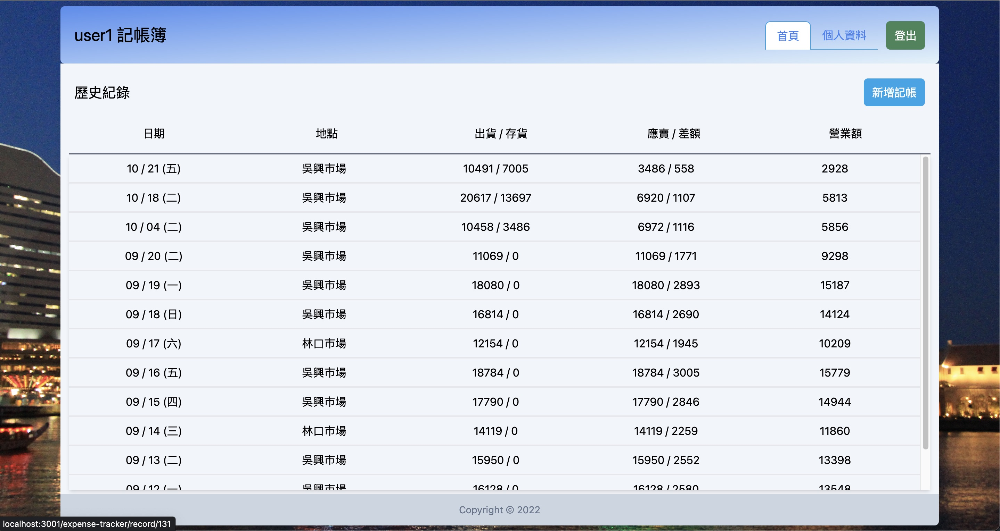
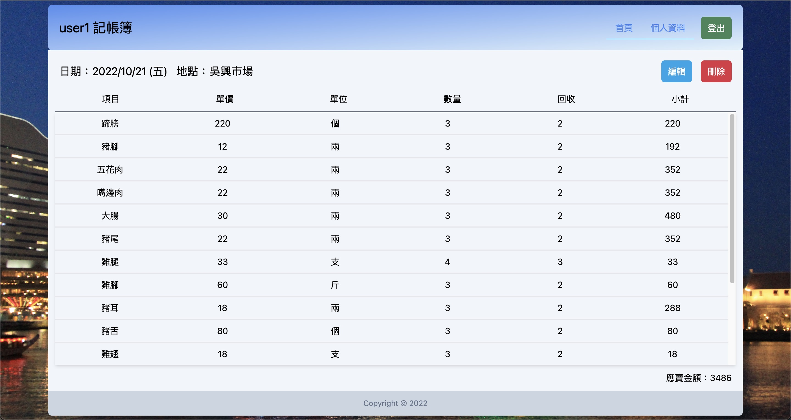
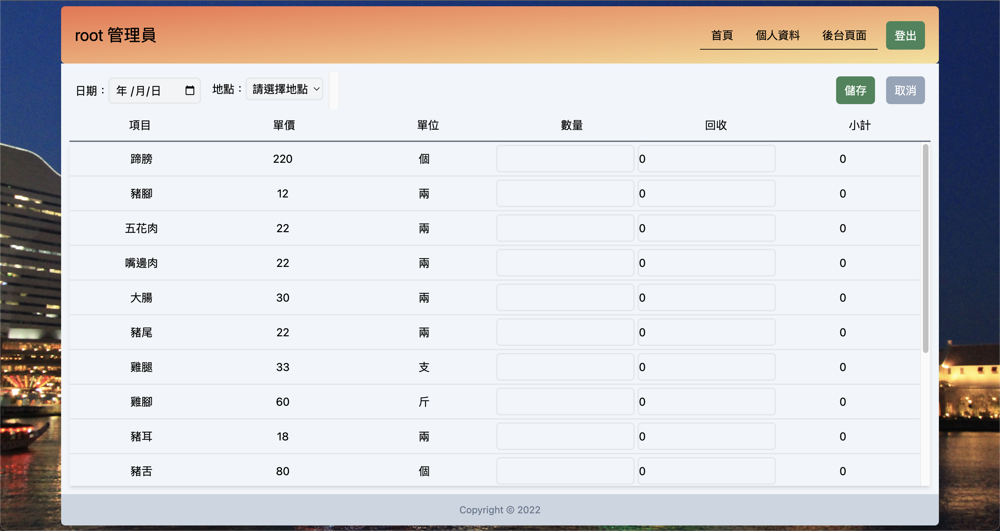
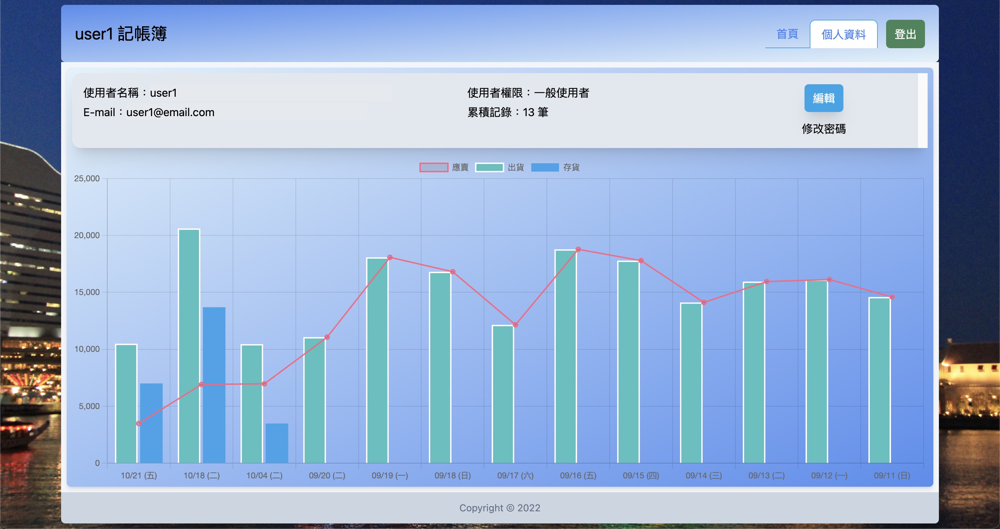
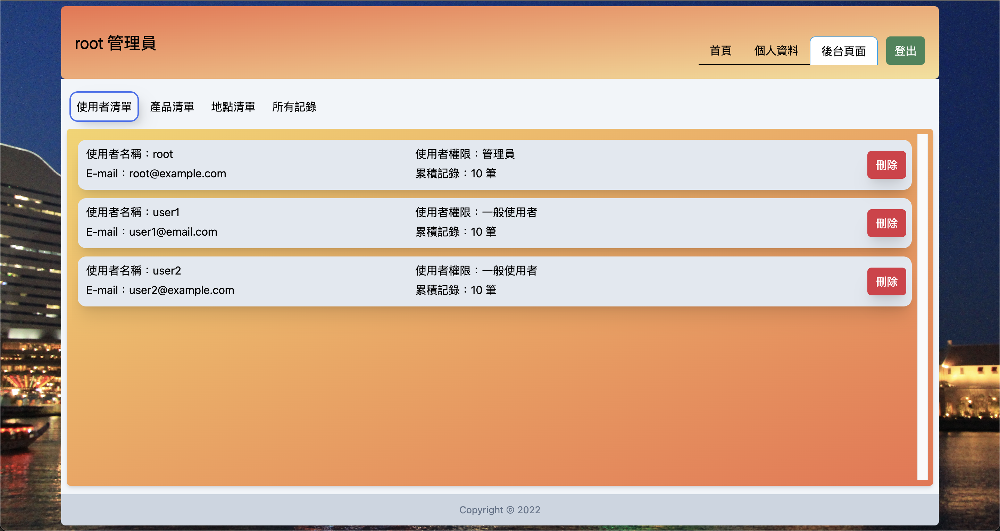
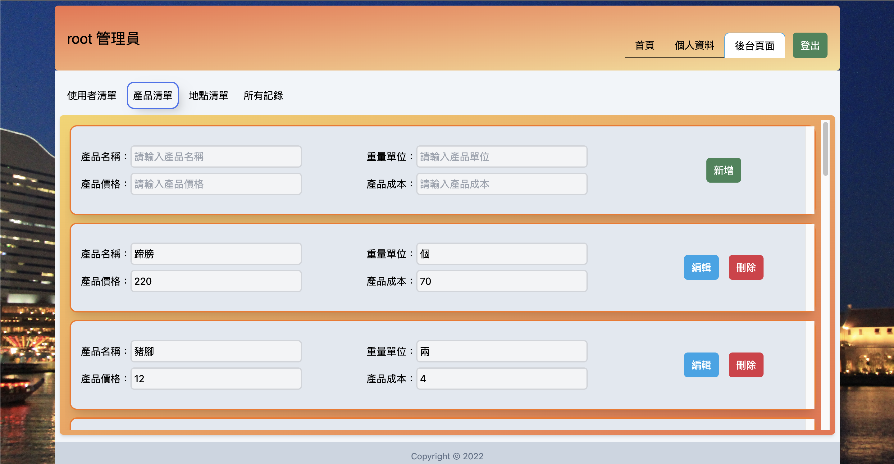

<h1>Expense-Tracker</h1>


## 基於 RCA 開發的記帳簿

#### 此專案目前功能有:

使用者

- 登入 / 註冊 / 登出 (尚未實作第三方登入)
- 修改登入帳號及密碼
- 新增 / 瀏覽 / 修改 / 刪除個人記錄
- 瀏覽近十筆出貨、存貨及銷售記錄趨勢圖

管理員權限

- 瀏覽使用者清單 / 刪除使用者
- 瀏覽 / 刪除所有使用者記錄
- 新增 / 修改 / 刪除產品清單
- 新增 / 修改 / 刪除地點清單

# 使用技術

```
React / Zustand / TailwindCSS / axios / react-router-dom / react-hook-form / sweetalert / Chart.js
```

# Get Started

#### 1. 下載專案

```
git clone https://github.com/Tommy1023/expense-tracker.git
```

#### 2. 初始化

```
npm install
```

#### 3. 設置環境變數

```
PUBLIC_URL = '/expense-tracker'
REACT_APP_API_URL = 'http://http://localhost:3000/api' (backend api base url)
```

#### 4. 啟動專案

```
npm start
```

### Demo

[測試網頁：https://locking751023.github.io/expense-tracker-demo/](https://locking751023.github.io/expense-tracker-demo/)

admin 測試帳號
帳號：root@example.com, 密碼：00000000

user 測試帳號
帳號：user1@example.com, 密碼：11111111

帳號：user2@example.com, 密碼：22222222








